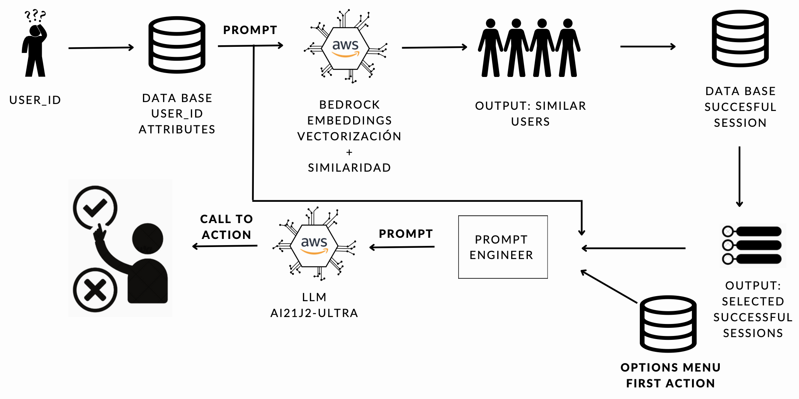
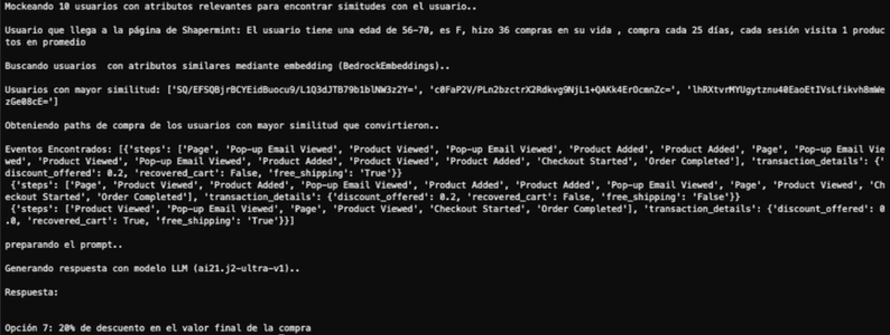

# First Action Booster - Product Documentation

Boost First Action is a tool designed to optimize digital marketing strategies when users access the homepage. It uses user behavior analysis and attributes to recommend personalized actions. The goal is to accelerate their purchase process by presenting options that have been successful for similar users.

## Key Components
The main logic of the product is found in: mim.net/work/bedrock_api.py

### get_response
- **Description:** This function is responsible for sending a prompt to the Bedrock AI API to obtain text-based predictions.
- **Parameters:**
  - `prompt`: Text sent to the AI to generate the response.
- **Returns:** The text generated by the AI21 J2-Ultra model, suggesting the most effective marketing action.

### promptear_users_2
- **Description:** Generates simulated user data for testing.
- **Parameters:**
  - `users`: Number of users for which to generate data.
- **Returns:** A dictionary with simulated prompts and user IDs.

### save_list_to_text_file
- **Description:** Saves data lists to text files.
- **Parameters:**
  - `list_data`: List of data to save.
  - `file_path`: Path of the file where the data will be saved.
- **Use:** This function is useful for storing simulation results or AI responses.

### finding_best_match
- **Description:** Searches for the most similar users within a database, based on embedding insertion.
- **Parameters:**
  - `text_items`: Texts from which to extract embeddings.
  - `ids`: Identifiers of the users corresponding to the texts.
  - `new_user`: Descriptive text of the new user to compare.
- **Returns:** IDs of the most similar users.

### get_success_events
- **Description:** Retrieves successful event paths from similar users to help predict effective actions.
- **Parameters:**
  - `user_ids`: List of user IDs whose event paths are to be queried.
- **Returns:** Event paths that have led to successful conversions.

## Utilization

The combination of these functions allows for implementing a powerful solution for targeted marketing based on data analysis and AI predictions, providing personalized recommendations that can be decisive for the success of marketing campaigns.

